# Topic3-LEMP

## Executive Summary

## Table of Contents

1. Xây dựng mô hình LEMP: Cài dặt Linux, Nginx, MySQL và PHP 8.1

2. Cài đặt web: Triển khai một trang web WordPress và một trang Laravel mặc định

3. Cấu hình SSL: Cài dặt chứng chỉ cho 2 domain (Sử dụng Certbot)

4. Tài khoản FTP: Tạo tài khoản FTP để quản lý file

5. Cấu hình MySQL: Thiết lập MySQL, bật truy cập bằng xa bằng user root

# LEMP

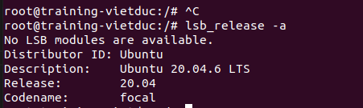

- Kiểm tra phiên bản Ubuntu của VPS

1. Cài NGINX

```bash
sudo apt update
sudo apt install nginx -y
```

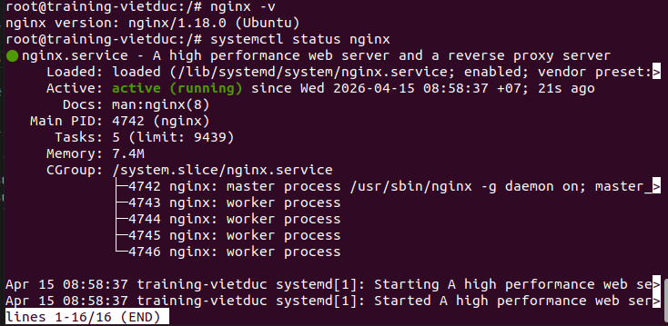

- Kiểm tra phiên bản và trạng thái hoạt động

2. Cài MySQL

```bash
sudo apt install mysql-server -y
sudo mysql_secure_installation
```

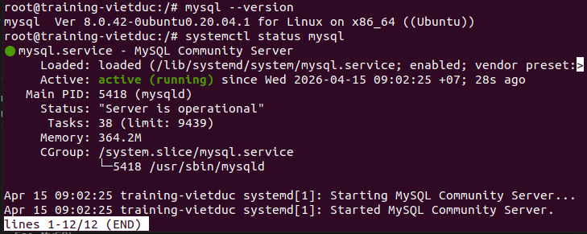

- Kiêm tra phiên bản và trạng thái hoạt động của MySQL

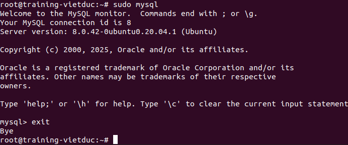

- Kiểm tra xem đăng nhập được bảng điều khiển MySQl không

3. Cài đặt PHP8.1-fpm

```bash
sudo apt install php8.1-fpm php-mysql
sudo systemctl status php8.1-fpm
```

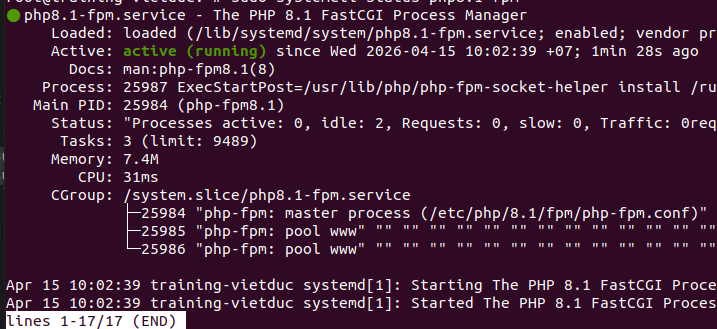

- Kiểm tra trạng thái

4. Cấu hình Nginx để xử dụng PHP

```bash
# Cho WordPress
sudo mkdir -p /var/www/wp.vietduc.vietnix.tech
# Cho Laravel
sudo mkdir -p /var/www/laravel.vietduc.vietnix.tech

# Gán quyền cho user hiện tại có thể upload file
sudo chown -R $USER:$USER /var/www/wp.vietduc.vietnix.tech
sudo chown -R $USER:$USER /var/www/laravel.vietduc.vietnix.tech
```

- Cấu hình cho WordPress:

```bash
sudo nano /etc/nginx/sites-available/wp.vietduc.vietnix.tech
```

```bash
server {
    listen 80;
    server_name wp.vietduc.vietnix.tech;
    root /var/www/wp.vietduc.vietnix.tech;

    index index.php index.html index.htm;

    location / {
        try_files $uri $uri/ /index.php?$args;
    }

    location ~ \.php$ {
        include snippets/fastcgi-php.conf;
        fastcgi_pass unix:/run/php/php8.1-fpm.sock;
    }

    location ~ /\.ht {
        deny all;
    }
}
```

- Giải thích file:
  - Lắng nghe HTTP (Port 80)
  - root: thư muc gốc nơi chứ code
- Tạo một file index.html để kiểm tra

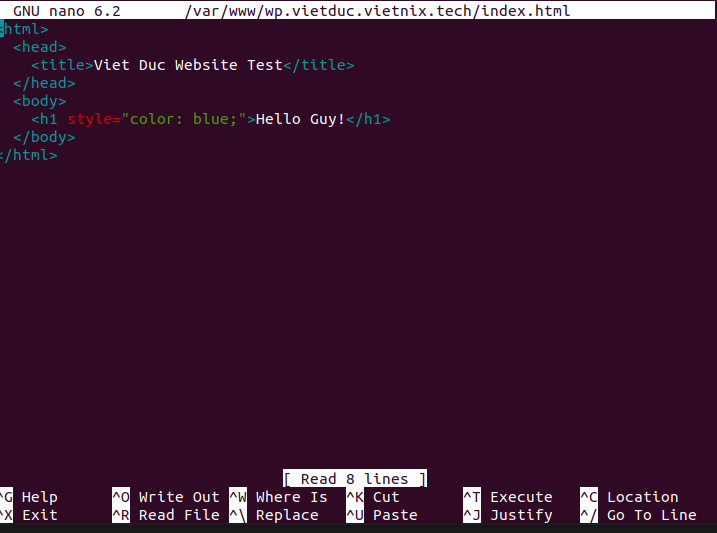

- Từ internet truy cập tên miền kết quả được file html

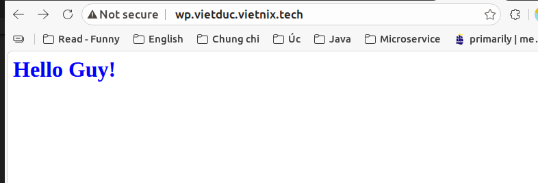

- Cấu hình cho Laravel:

```bash
sudo nano /etc/nginx/sites-available/laravel.vietduc.vietnix.tech
```

```bash
server {
    listen 80;
    server_name laravel.vietduc.vietnix.tech;
    root /var/www/laravel.vietduc.vietnix.tech/public;

    index index.php index.html;

    location / {
        try_files $uri $uri/ /index.php?$query_string;
    }

    location ~ \.php$ {
        include snippets/fastcgi-php.conf;
        fastcgi_pass unix:/run/php/php8.1-fpm.sock;
    }
}
```

- Cài đặt laravel
  Bước 1: Cài đặt các thư viện PHP bổ trợ

```bash
sudo apt update
sudo apt install php8.1-mbstring php8.1-xml php8.1-bcmath php8.1-curl php8.1-zip -y
```

Bước 2: Dùng Composer tạo dự án Laravel

```bash
cd /var/www

composer create-project laravel/laravel laravel.vietduc.vietnix.tech
```

Bước 3: Cấp quyền cho Nginx

```bash
sudo chown -R www-data:www-data /var/www/laravel.vietduc.vietnix.tech/storage
sudo chown -R www-data:www-data /var/www/laravel.vietduc.vietnix.tech/bootstrap/cache
sudo chmod -R 775 /var/www/laravel.vietduc.vietnix.tech/storage
```

Bước 4: Kiểm tra

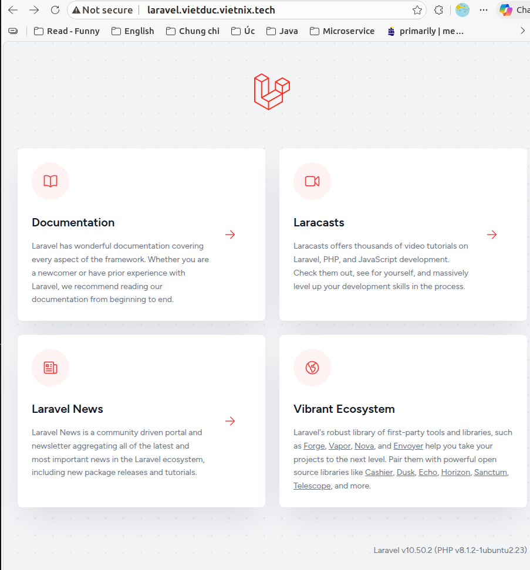

- Kích hoạt và kiểm tra:

```bash
# Tạo link liên kết để kích hoạt
sudo ln -s /etc/nginx/sites-available/wp.vietduc.vietnix.tech /etc/nginx/sites-enabled/
sudo ln -s /etc/nginx/sites-available/laravel.vietduc.vietnix.tech /etc/nginx/sites-enabled/

# Hủy bỏ site mặc định
sudo unlink /etc/nginx/sites-enabled/default

sudo nginx -t

sudo systemctl reload nginx
```

5. Cấu hình SSL sử dụng Certbot

```bash
sudo apt install certbot python3-certbot-nginx -y
sudo certbot --nginx
```

- Sau đó nhập email để nhận thông báo gia hạn
- Chọn 1: laravel.vietduc.vietnix.tech để bảo mật tên miền này
- Sau khi xong Certbot sẻ tự sửa config Nginx, tự cài SSL

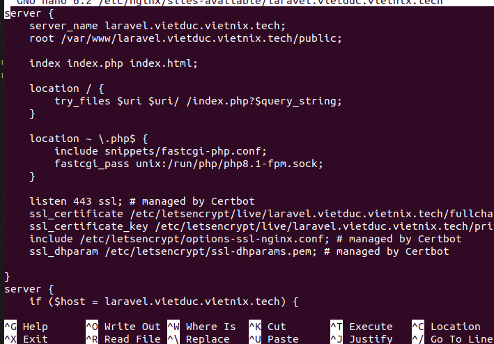

- Kết quả:

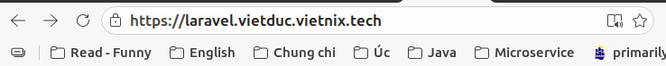

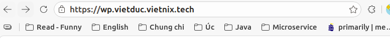

6. Tạo tài khoản FTP

```bash
# Cai dat dich vu
sudo apt update

sudo apt install vsftpd -y

# Tao User va cap quyen
sudo adduser ftpuser

sudo usermod -aG www-data ftpuser

sudo chown -R www-data:www-data /var/www/
sudo chmod -R 775 /var/www/

# Cau hinh cho phep ghi file
sudo nano /etc/vsftpd.conf

# Bo # truoc dong write_enable=YES
sudo systemctl restart vsftpd
```

- Kiểm tra hoạt động:

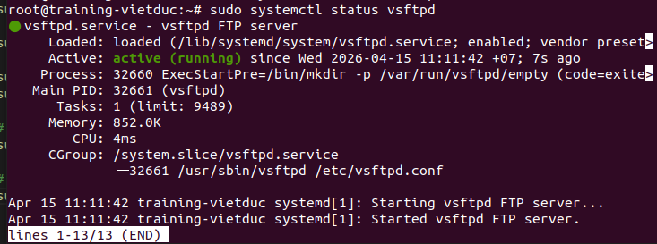

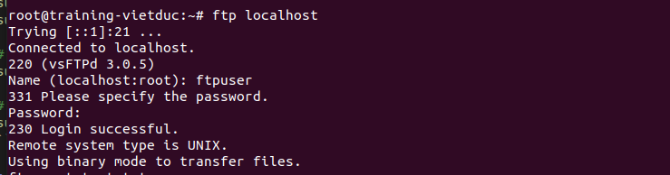

7. Bật remote MySQL cho user Root

```bash
# Tìm dòng bind-address = 127.0.0.1 và sửa thành:

bind-address = 0.0.0.0
```

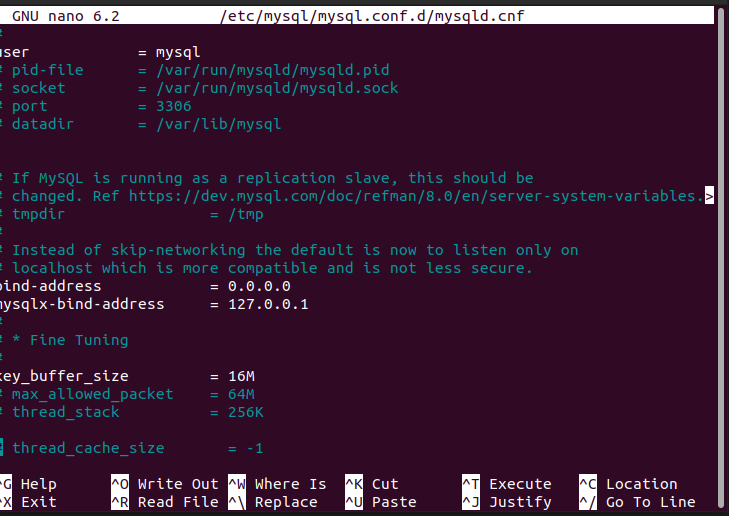

- Cấp quyền Remote cho Root

```bash
sudo mysql -u root -p

## Cập nhật user root để chấp nhận kết nối từ xa
# 1. Cho phép dùng mật khẩu đơn giản
SET GLOBAL validate_password.policy=0;
SET GLOBAL validate_password.length=4;


-- Nếu lệnh này báo "User already exists", không sao cả, làm tiếp lệnh dưới
CREATE USER IF NOT EXISTS 'root'@'%' IDENTIFIED BY '1111';

# 3. Cấp quyền tối cao cho user root từ xa
GRANT ALL PRIVILEGES ON *.* TO 'root'@'%' WITH GRANT OPTION;

-- 4. Áp dụng thay đổi ngay lập tức
FLUSH PRIVILEGES;

# Kiem tra ở máy khác
mysql -h 221.132.21.144 -u root -p
```

- Kết quả khi remote vào mysql:

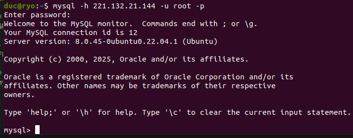
