# Topic 5: CPanel

## Config

1. Wordpress

- Nén Source code trên VPS:

```bash
ssh root@221.132.21.144 "tar -cvzf /root/wp.tar.gz -C /var/www/wp.vietduc.vietnix.tech . && tar -cvzf /root/laravel.tar.gz -C /var/www/laravel.vietduc.vietnix.tech ."
```

- Dump Database

```bash
ssh root@221.132.21.144 "mysqldump -u root -p db_wordpress > /root/wp.sql && mysqldump -u root -p db_laravel > /root/laravel.sql"
```

- Tải toàn bộ về máy cá nhân:

```bash
mkdir -p ~/vietnix_backup && cd ~/vietnix_backup
scp root@221.132.21.144:/root/{*.tar.gz,*.sql} ./

# Lấy luôn SSL Cert để tí copy vào cPanel
scp root@221.132.21.144:/etc/letsencrypt/live/laravel.vietduc.vietnix.tech/fullchain.pem ./laravel_fullchain.pem
scp root@221.132.21.144:/etc/letsencrypt/live/laravel.vietduc.vietnix.tech/privkey.pem ./laravel_privkey.pem
```

- Trỏ domain về IP Hosting (Máy cá nhân)

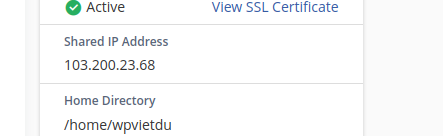

```bash
sudo nano /etc/hosts

IP  wp.vietduc.vietnix.tech
IP  laravel.vietduc.vietnix.tech
```

Cấu hình Database trên Hosting

- Tạo DB: Vào MySQL Database Wizard, tạo database và user

- Import: Vào phpMyAdmin, chọn DB vừa tạo -> Import file .sql từ máy cá nhân.

- Kết nối code:

      - WordPress: Sửa file wp-config.php trong File Manager.

      - Laravel: Sửa file .env. Lưu ý: DB_HOST thường là localhost.

  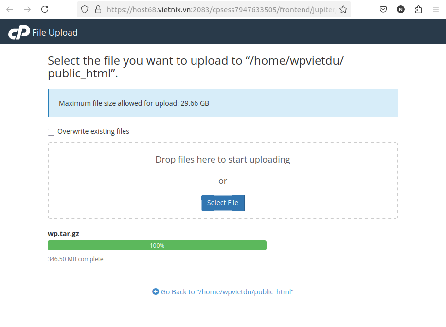

- Thêm source wp vào và giải nén

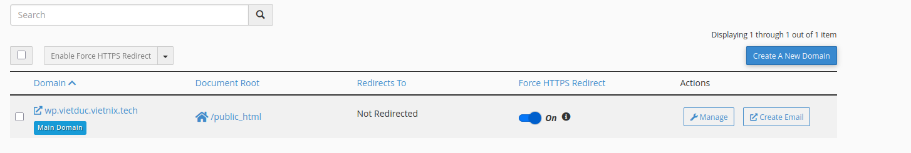

- Tùy chọn Force HTTPS Redirect có tác dụng tự động chuyển hướng mọi truy cập từ giao diện không bảo mật http sang https
- Thay vì phaair viết code trong file .htaccess của wp hay laravel cPanel sẻ tự động xử lí việc này ở tầng hệ thống web server

- Bật tắt DEBUG MODE: Khi bật sẽ hiển thị lỗi chi tiết, khi tắt sẽ ẩn lỗi và hiển thị thông báo lỗi chung chung. Nên để tắt trên môi trường production để tránh lộ thông tin nhạy cảm.

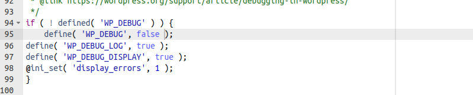

- Kết quả sau khi hoàn thành:

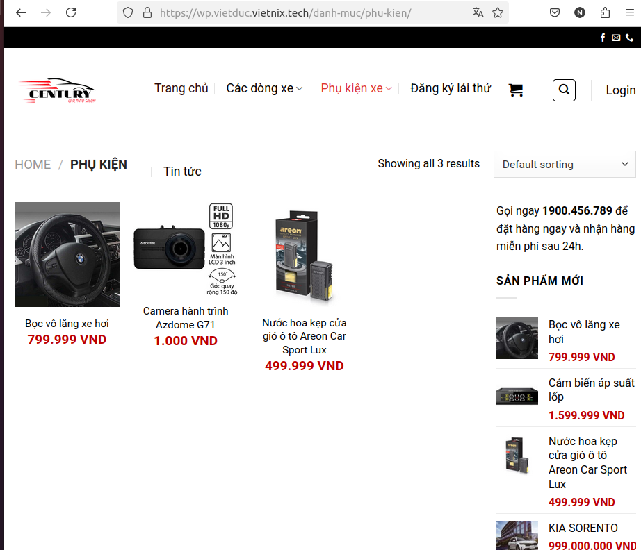

2. Laravel

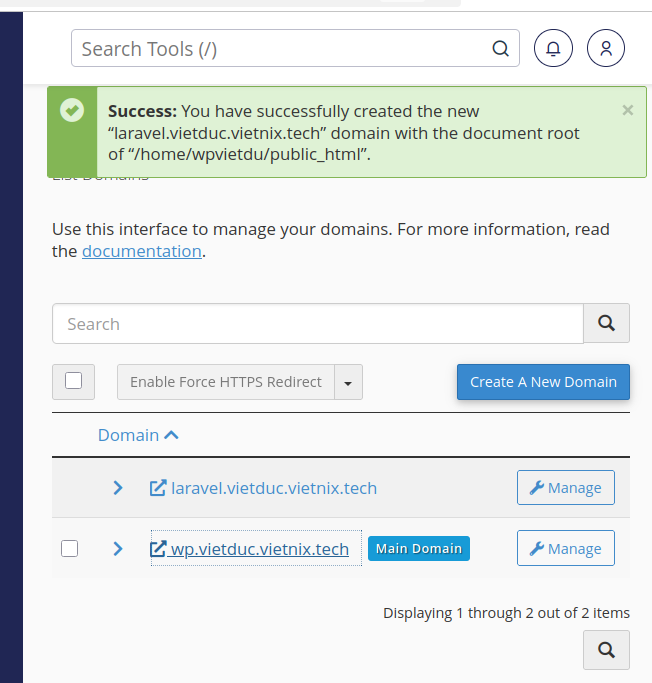

- Khai báo domain cho laravel

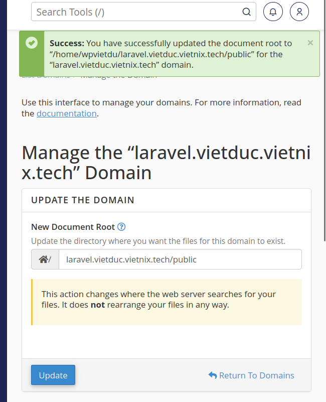

- Khi truy cập domain, server sẻ tự hiểu là thư mục gốc là public

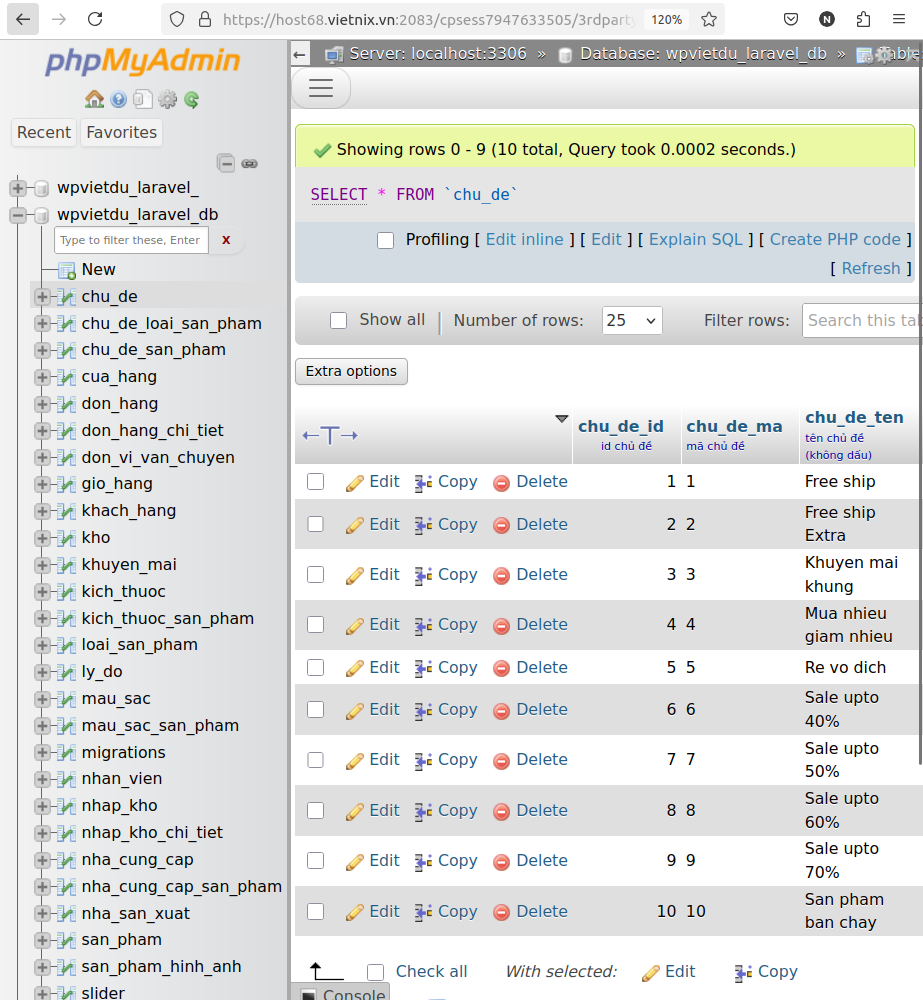

- Import file .sql vào database đã tạo trên hosting

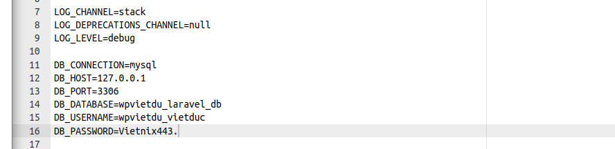

- Vao file .env sửa lại thông tin kết nối database

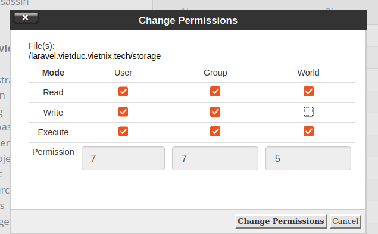

- Thiết lập quyền 775 cho thư mục storage

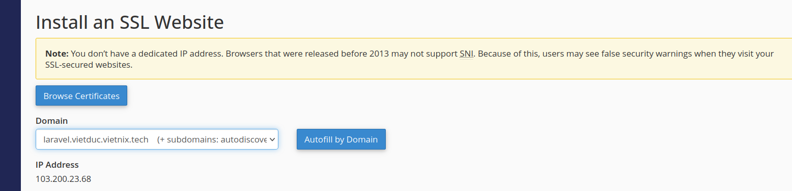

- Add các key vào đây

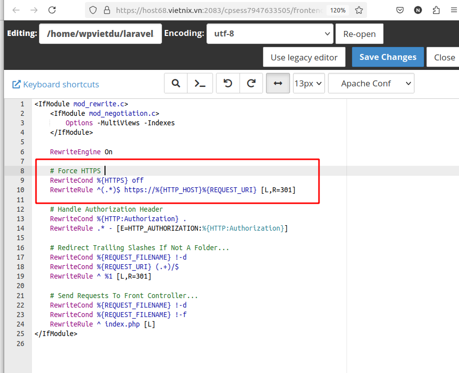

- Sửa file .htaccess để auto redirect về https

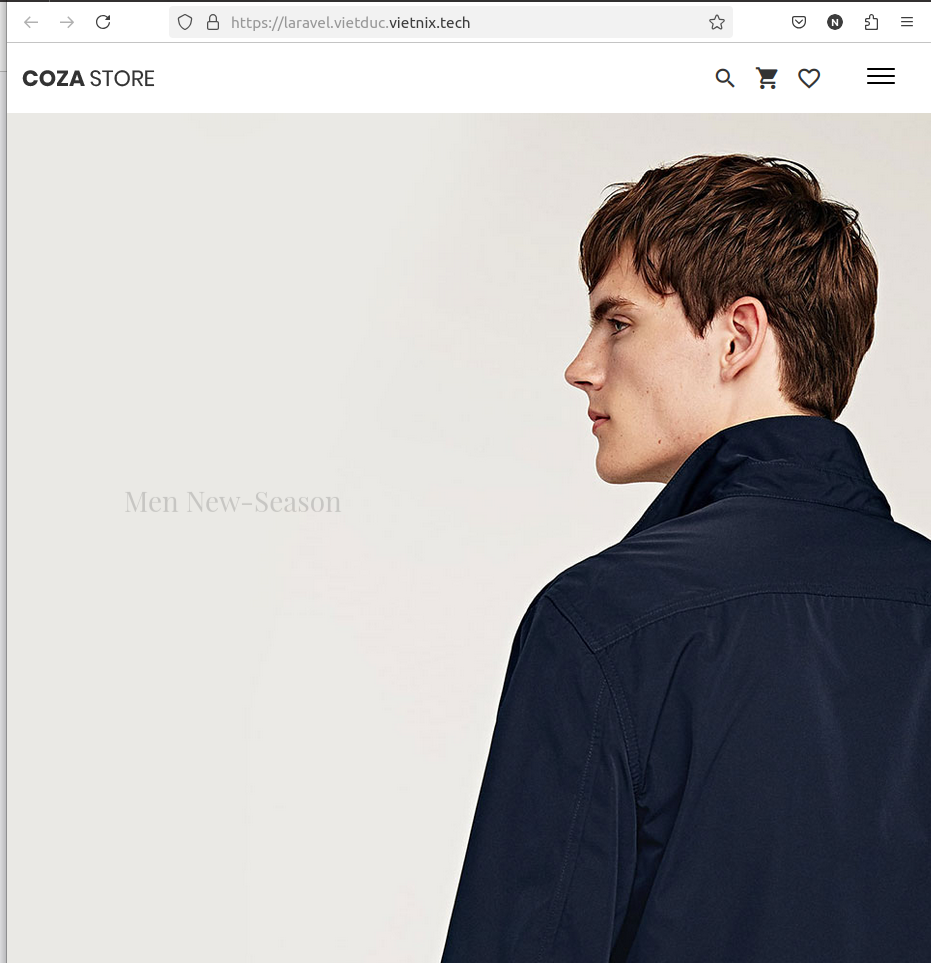

- Kết quả khi vào laravell
