# Topic 6: AAPanel

## Config

1. So sánh CPanel và AAPanel

- CPanel: Giống như một "siêu thị trọn gói". Mọi thứ đã được đóng gói sẵn trong một khuôn khổ cực kỳ chặt chẽ. Không thể dễ dàng thay đổi phiên bản MySQL hay cấu hình Web Server ở tầng sâu vì nó ảnh hưởng tới đến toàn bộ các user khác. CPanel ưu tiên tính ổn định và bảo mật cho số đông người dùng không chuyên
- AAPanel: Linh hoạt hơn ta có thể đổi phiên bản cho MySQL, NGINX,..

2. Plugin: ALl-in-One WP Migration and Backup là một trong những công cụ để di chuyển (migration), sao lưu (backup) hoặc nhân bản webstite WordPress. Giúp đưa toàn bộ web từ local lên hosting, từ VPS này sang VPS khác hoặc từ cPanel sang aaPanel một cách nhanh chóng

- Thay vì phải tải source code qua FTP/SCP, sau đó export database .sql rồi vào môi trường mới sửa file wp-config.php và chạy lệnh SQL để thay đổi URL, thì plugin này làm tất cả trong một file duy nhất (.wpress) - Nó nén database, media, plugins và themes - Khi chuyển từ domain cũ sang domain mới, tự động quét toàn bộ DB để đổi link, tránh tính trạng lỗi giao diện hoặc mất ảnh

  Bước 1: Xuất dữ liệu (Export) - Tại Website cũ

      Cài đặt và Kích hoạt plugin All-in-One WP Migration.

      Vào menu All-in-One WP Migration -> Export.

      Chọn Export To -> File.

      Đợi plugin nén xong, tải file .wpress về máy cá nhân.

          Có thể dùng tính năng "Find <text> Replace with <another text>" ngay lúc này nếu muốn đổi link trước khi xuất.

Bước 2: Nhập dữ liệu (Import) - Tại Website mới

    Cài một bản WordPress trắng trên aaPanel (hoặc hosting mới).

    Cài đặt và Kích hoạt cùng plugin All-in-One WP Migration.

    Vào menu All-in-One WP Migration -> Import.

    Chọn Import From -> File và chọn file .wpress đã tải về trước đó.

    Một bảng cảnh báo hiện lên nói rằng việc này sẽ ghi đè lên dữ liệu hiện tại -> Nhấn Proceed.

    Quan trọng nhất: Sau khi xong, hệ thống yêu cầu vào Settings -> Permalinks và nhấn Save Changes 2 lần để cập nhật lại cấu trúc đường dẫn.

-> Nên dùng khi web có dung lượng dưới 2GB. Nếu quá lớn nên dùng lệnh rsync và export DB thủ công qua CMD.

3. Tạo web

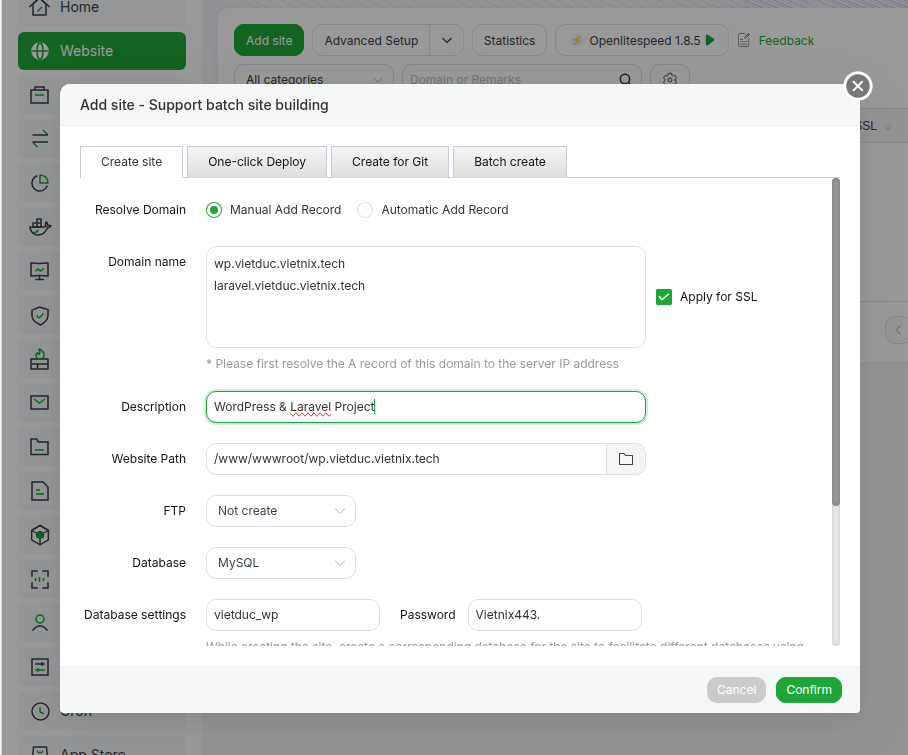

- Nhập cả 2 domain vào
- Đặt tên cho db và password

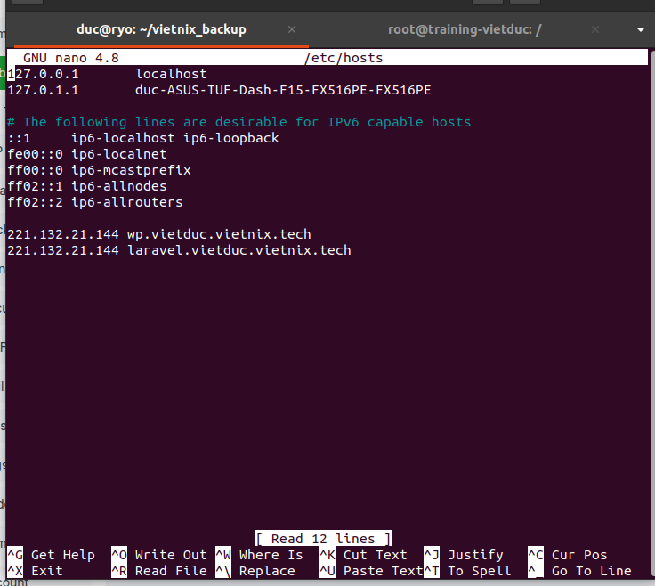

- Từ cmd trỏ về địa chỉ IP của VPS

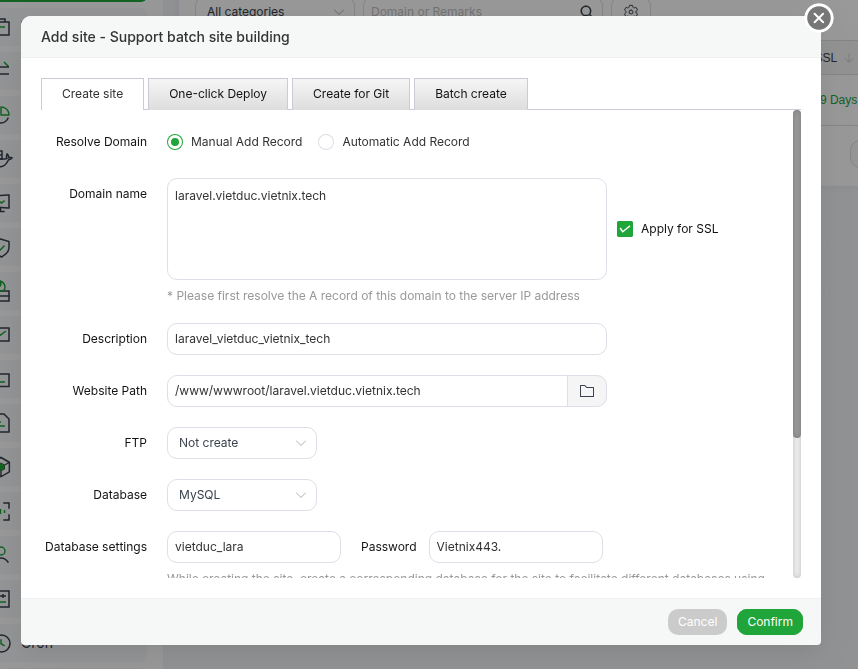

- Cài cho Laravel

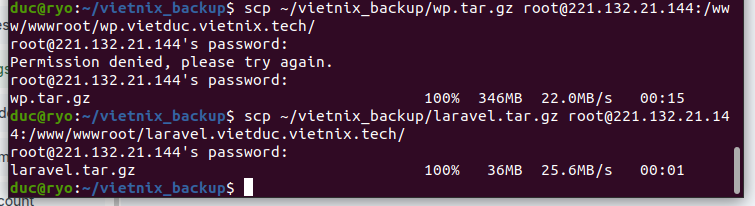

- Đẩy source code lên vps

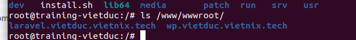

- Kiểm tra tại vps

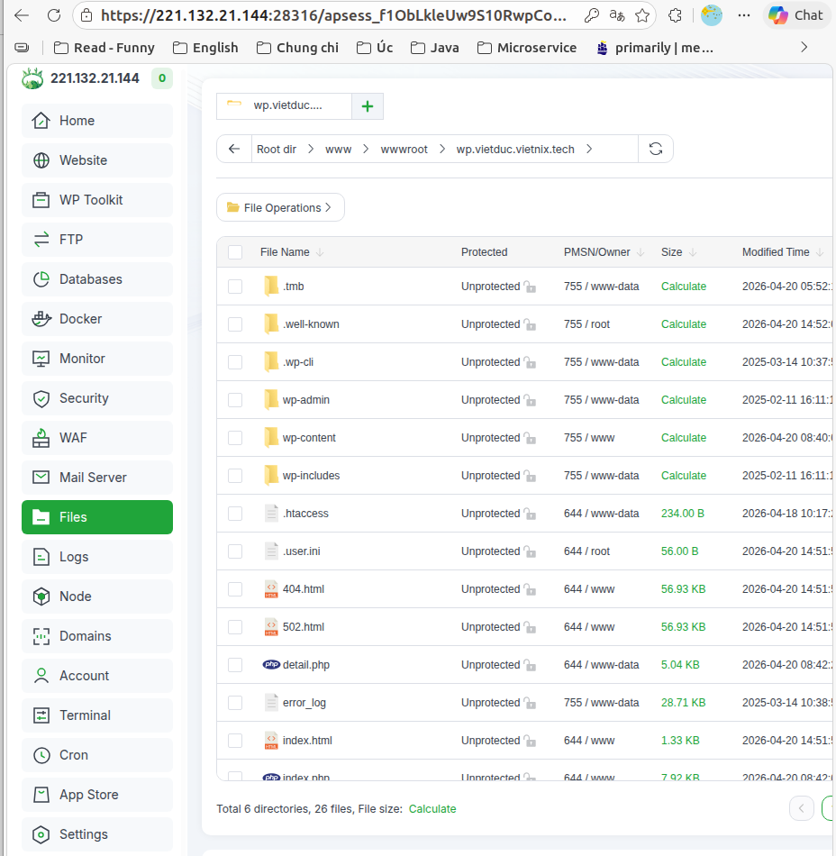

- Tiến hành giải nén từng file

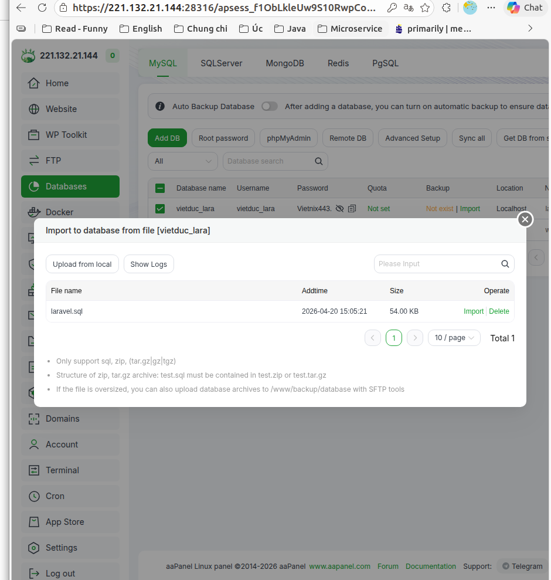

- Upload file .sql

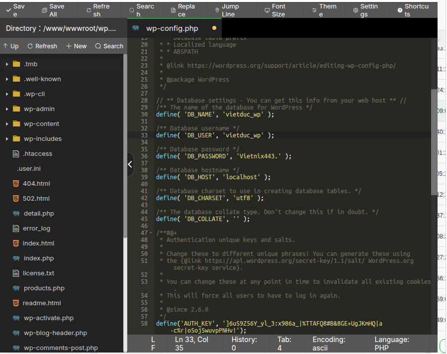

- Trong file wp-config.php sửa lại cấc thông tin

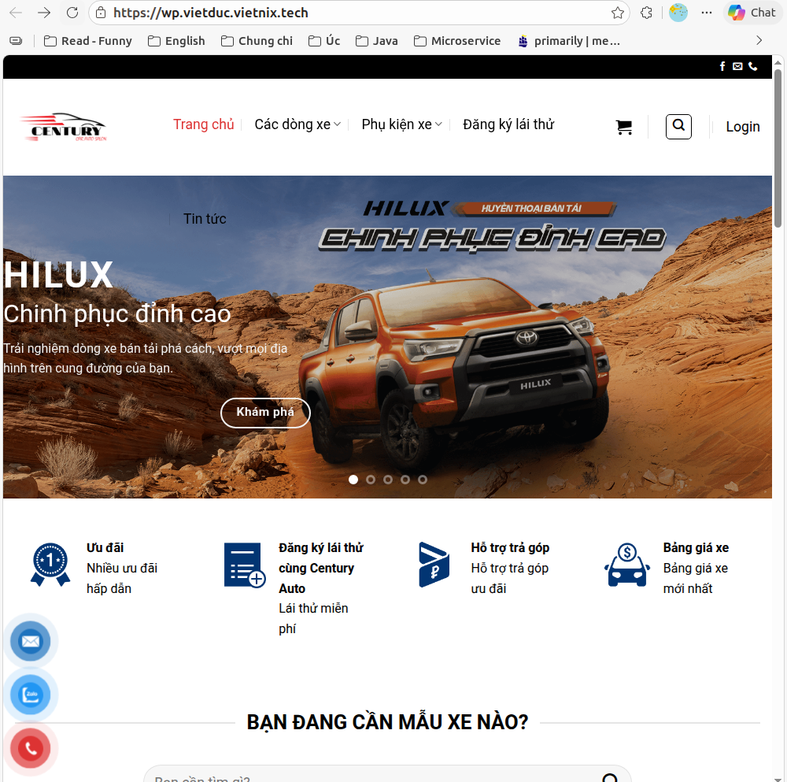

- Kết quả sau khi deploy wp

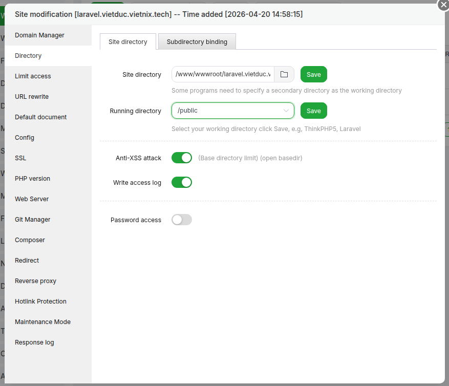

- Vào Web chọn Site dicrectory để chọn /public

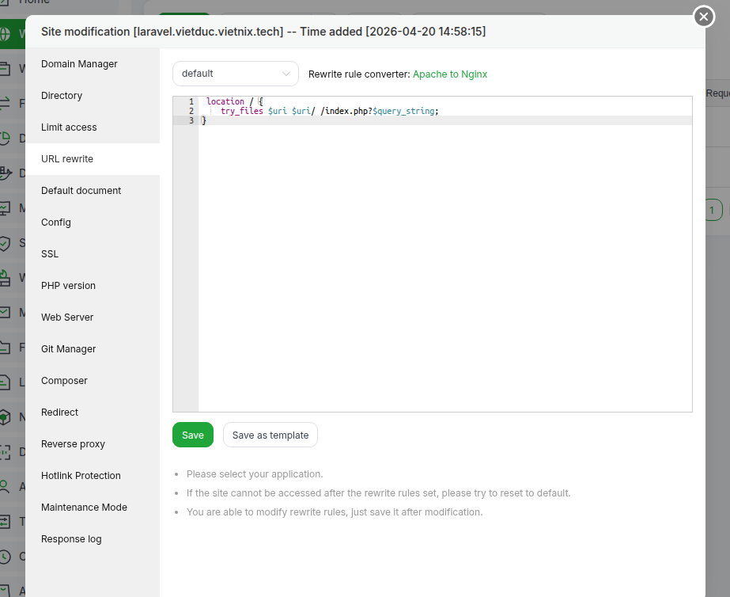

- Chọn default: Nếu không tìm thấy file hoặc thư mục thực tế hãy, đẩy toàn bộ yêu cầu vào file index.php với các tham số đi kèm

- Kết quả khi deploy laravel

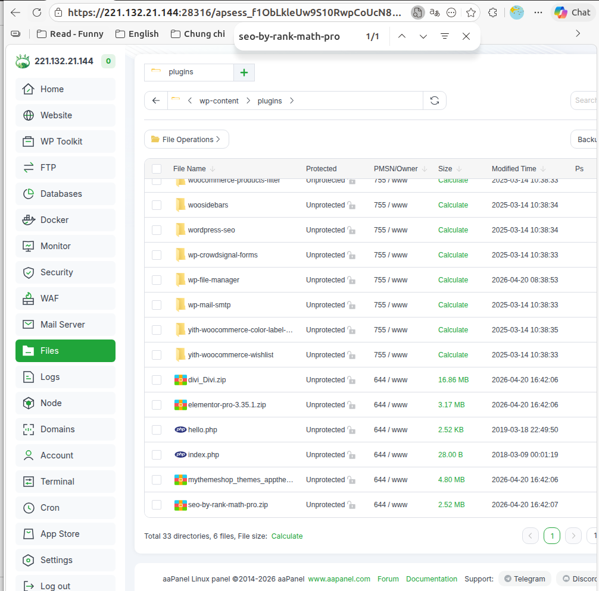

- Vào files /wp-content/plugin tải tất cả plugin và giải nén

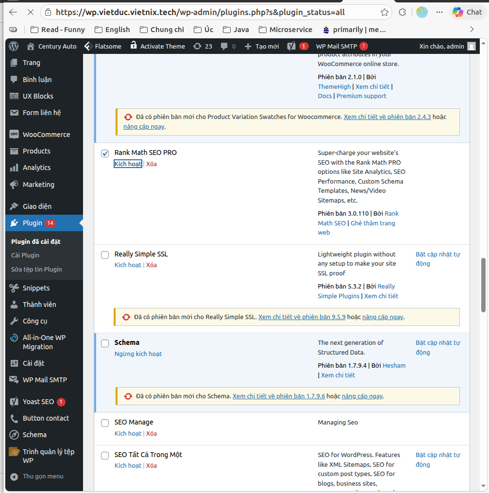

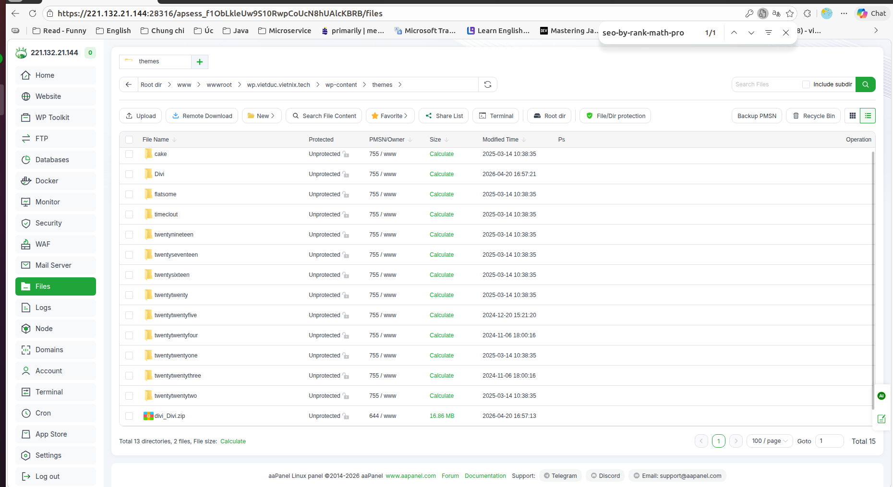

- Vào themes: import và giải nén divi

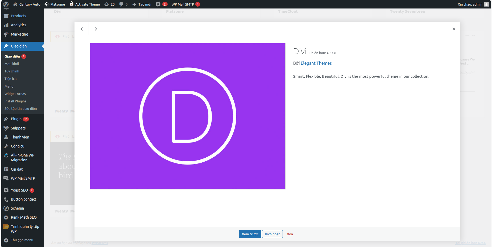

- Nhấn kích hoạt

- Đăng nhập vào wp và chọn plugin nhấn kích hoạt

4. WP-Optimize - Cache và LiteSpeed Cache (LSCache)
   WP - Optimize:

- Là một công cụ tối ưu hóa Database và Page Cache và nén ảnh
  - Dọn dẹp database: Xóa các bản nhán cũ (revisions), bình luận rác, các bảng dữ liệu mồ côi (overhead) để giảm dung lượng file .sql giống như VACCUM trong Postgre khi thay đổi hay xóa dữ liệu nó không xóa dòng đó mà nó ẩn dòng đó đi và tạo dòng mới
  - Nén ảnh: Chuyển đổi sang WebP hoặc giảm duong lượng ảnh trực tiếp trên server
  - Page Caching: Tạo các file HTML tĩnh để giảm tải cho CPU khi xử lí PHP
- Nên dùng khi:
  - Server chạy Nginx hoặc Apache (không có LiteSpeed tầng server)
  - Khi web có quá nhiều Revsion (bản nháp bài viết) làm chậm các câu truy vấn SQL

LiteSpeed Cache (LSCache)

- Server-level Cache: lưu cache ở tầng hệ thống, Nhanh hơn rất nhiều so với cache ở tầng PHP của các plugin khác
- ESI (Edge Side Includes): Cho phép cache các phần tĩnh của trang web trong khi vẫn giữ các phần động (như giõ hàng, thông tin user) được cập nhật.
- Image Optimization & CDN: tinhs hợp sẵn dịch vụ nén ảnh từ Cloud của QUIC.cloud

| Tính năng          | WP-Optimize                      | LiteSpeed Cache                      |
| ------------------ | -------------------------------- | ------------------------------------ |
| Cơ chế Cache       | PHP-level (chậm hơn một chút)    | Server-level (cực nhanh)             |
| Ưu tiên Web Server | Nginx, Apache                    | OpenLiteSpeed, LiteSpeed             |
| Thế mạnh nhất      | Dọn dẹp & tối ưu Database        | Tốc độ load trang & tối ưu CSS/JS    |
| Chi phí            | Free (bản Pro có thêm tính năng) | Free (yêu cầu dùng server LiteSpeed) |

| Tình huống                        | Lựa chọn tối ưu | Lý do                                                                                                  |
| --------------------------------- | --------------- | ------------------------------------------------------------------------------------------------------ |
| Server là LiteSpeed/OpenLiteSpeed | LiteSpeed Cache | Tận dụng tối đa sức mạnh phần cứng, tốc độ vượt trội                                                   |
| Server là Nginx/Apache            | WP-Optimize     | LSCache không phát huy được server-level cache trên Nginx/Apache, WP-Optimize mạnh về dọn dẹp database |
| Web có Database quá nặng/phình to | Cài cả hai      | Dùng WP-Optimize để dọn dẹp database định kỳ và LSCache để tăng tốc (nếu server hỗ trợ)                |
