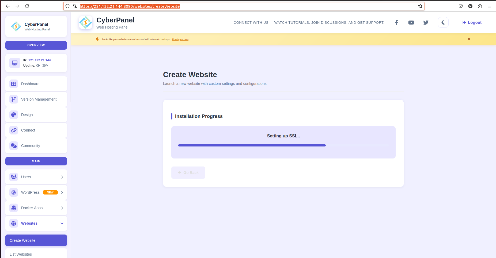
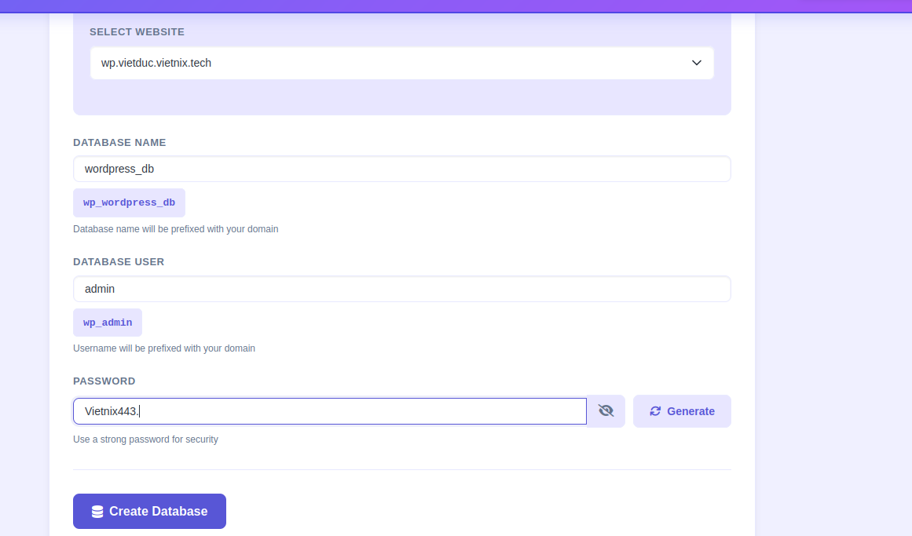
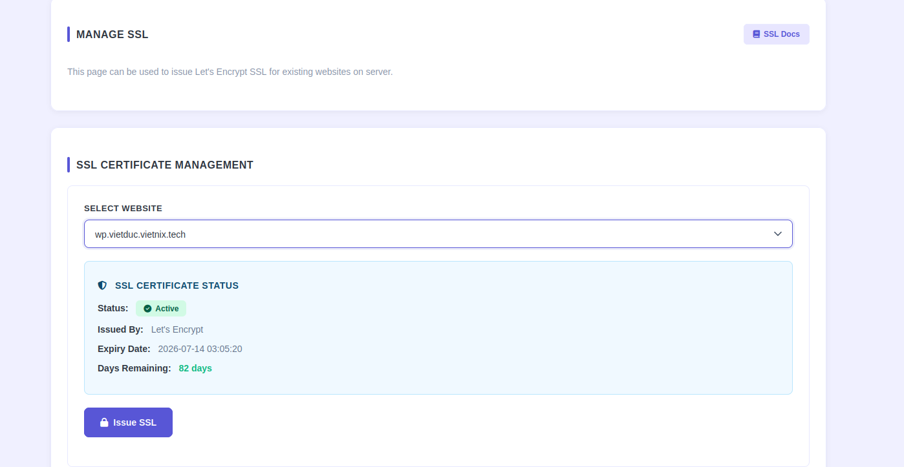
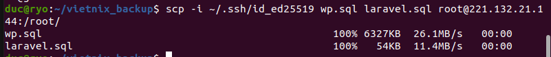
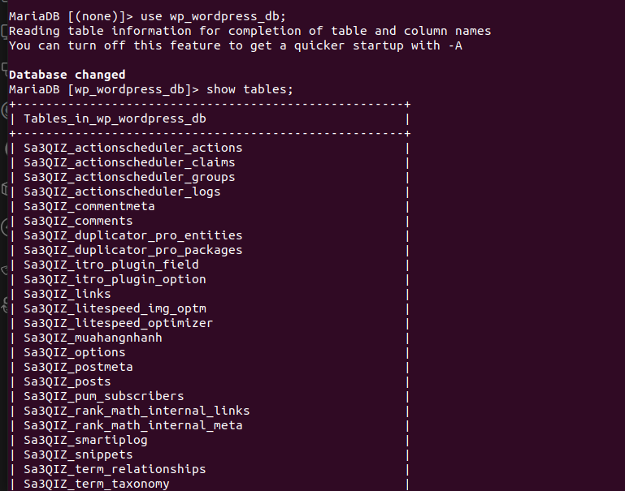
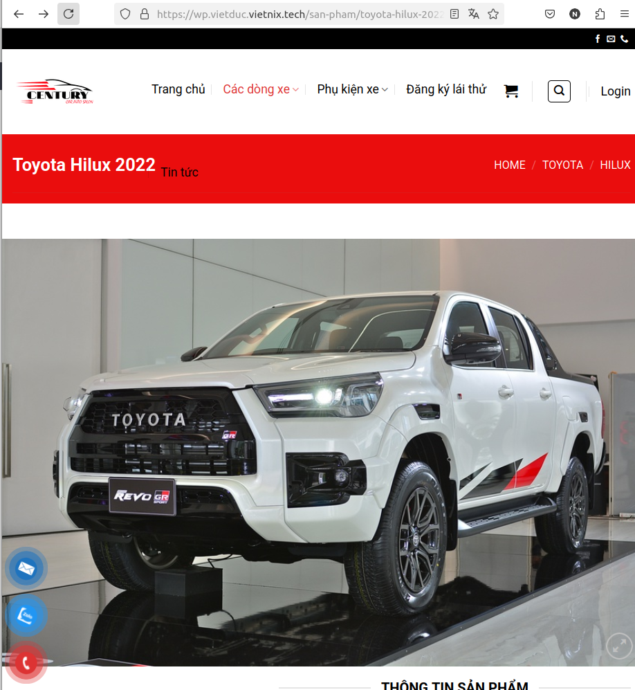
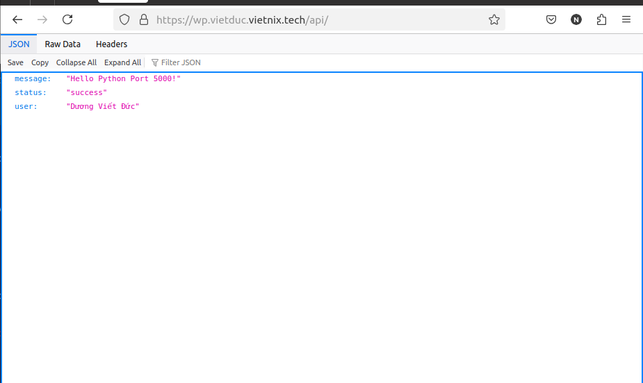

# Topic7 - CyberPanel

## Table of Contents

1. Cyber Panel là gì
   Là một con control panel (Bảng điều khiển web hosting) giúp quản lí server dễ hơn, không cần làm mọi thứ bằng command line

2. Cài đặt

```bash
sudo apt update && sudo apt upgrade -y

sh <(curl https://cyberpanel.net/install.sh || wget -O - https://cyberpanel.net/install.sh)

# Infor Login
Visit: https://221.132.21.144:8090
                Panel username: admin
                Panel password: bXveUk0V3W4Ihd4y
```



- Tiến hành cài websites



- Tạo database
  Database Name: wp_wordpress_db
  Database User: wp_admin

  Database Name: lara_laravel_db
  Database User: lara_admin



- Cấu hình ssl cho 2 domain



- Import 2 file .sql vao DB



- Kiểm tra

Giải thích quy trình xử lý của LiteSpeed:

    User truy cập web.

    Listener nhận yêu cầu và dẫn vào Virtual Host.

    Script Handler thấy đuôi .php nên hỏi: "Ai chạy cái này?".

    Nó tìm đến External App có tên lsphp81.

    External App kích hoạt file thực thi tại đường dẫn Command để xử lý code WordPress và trả kết quả về trình duyệt.


- Kết quả khi vào Laravel



- Kết quả khi vào Wordpress

3. Cài đặt cổng 5000 và foward khi truy cập /api

```bash
#Cài đặt gói hỗ trợ venv
apt update
apt install python3-venv python3-full -y

#Tạo thư mục dự án và môi trường ảo:
mkdir -p /home/python-app
cd /home/python-app
python3 -m venv venv

#Cài đặt Flask vào môi trường ảo:
./venv/bin/pip install flask

nano /home/python-app/app.py


```

```bash
from flask import Flask, jsonify

app = Flask(__name__)

@app.route('/api')
def api_test():
    return jsonify({
        "status": "success",
        "message": "Hello từ Python Port 5000!",
        "user": "Dương Viết Đức"
    })

if __name__ == '__main__':
    app.run(host='0.0.0.0', port=5000)
```

- Run app

```bash
/home/python-app/venv/bin/python3 /home/python-app/app.py &
```



- Kết quả khi truy cập vào /api

## Sơ đồ luồng xử lí khi truy cập https://wp.vietduc.vietnix.tech/api

1. OpenLiteSpeed nó nhận request, giải mã SSL

- Nhìn vào Virtual Host Mapping ở Listener dể biết request nỳ thuộc về vhost wp.vietduc.vietnix.tech
- Tiếp theo, nó đối chiếu đường dẫn (URI). Nó thấy /api khớp với cấu hình Context

2. Thay vì tìm file trong thư mục public_html, nó sẽ forward request đến cổng 5000
3. Flask app đang chạy trên cổng 5000 nhận request, xử lý và trả về JSON response
4. OpenLiteSpeed nhận response từ Flask, mã hóa SSL và gửi lại cho trình duyệt. Trình duyệt hiển thị kết quả JSON.

## Các lỗi và cách giải quyết

1.  Lỗi Webstire Wordpress xoay vòng (Timeout/Socket)

- Triệu trứng: Web load mãi không lên, log xuất hiện lệnh kill PHP liên tục
- Nguyên nhân: Lỗi giao tiếp giữa LiteSpeed và PHP qua Unix Socket
- Giải pháp: Kiểm tra đường dãn file lsphp
  - Chuyển từ dùng Socket sang TCP Port (127.0.0.1:9081)
  - Kiểm tra dịch vụ Database

2. Lỗi 500&404 trên Wordpress

- Thiếu file .htaccess để điều hướng
- Tạo file .htaccess và bật Rewrite Engine trong Virtual Host

3. Lỗi SSL không hoạt động

- Truy cập Laravel nhưng trình duyệt báo chứng chỉ hợp lệ cho Wp
- Cấu hình SSL ở cấp độ Listener bị ghi đè
- Key All Listened: Dùng để kích hoạt cổng: Listener cần một bộ Key/Cert hợp lệ để khởi tạo tiến trình lắng nghe (listening process) trên cổng 443. Không có nó, OLS sẽ báo lỗi cấu hình và Shutdown

4. Lỗi không thể truy cập vào Laravel

- Cấu trúc thư mục sai public_html/public
  etc...
