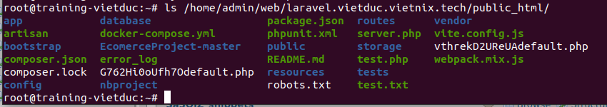
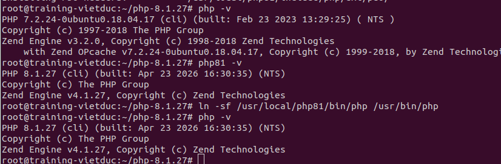
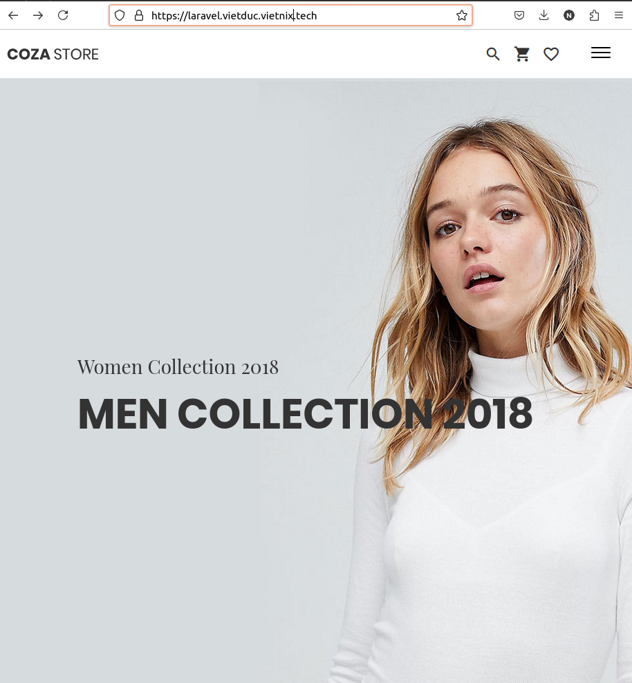
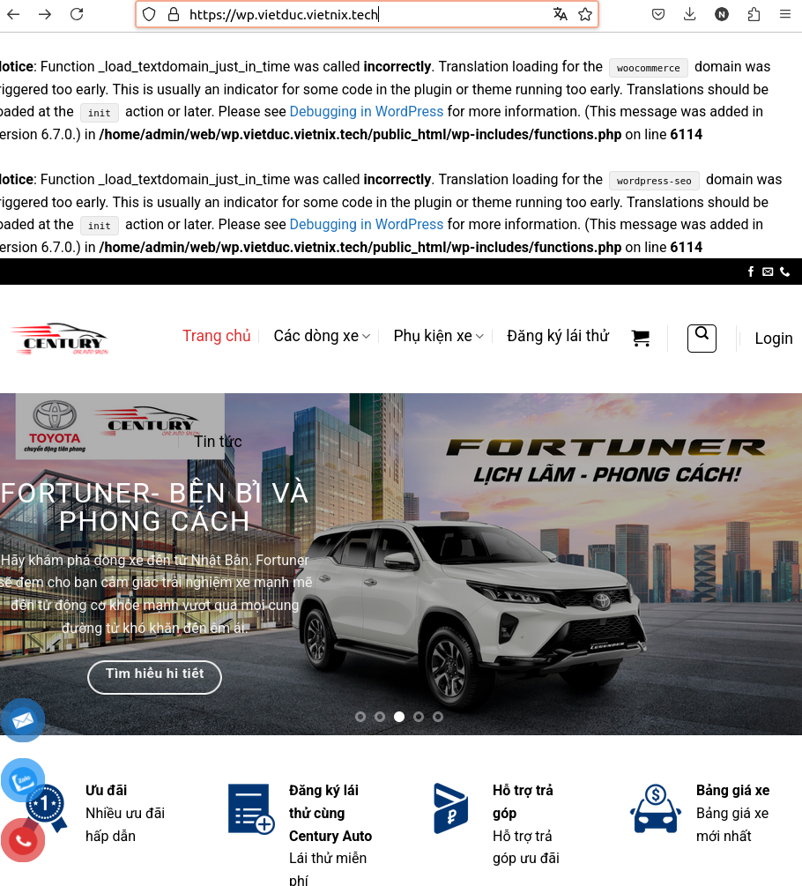

# Topic8 - VestaCP

## Table of Contents

# 1. Các file cấu hình

- Cấu hình Apache: /home/amin/conf/web/domain.apache2.conf
  - Mục đích: Chứa thông tin DocumentRoot, log và các chỉ dẫn PHP. Nếu chạy Laravel, cần sửa DocumentRoot ở đây từ public_html thành public_html/public.
- Cấu hình Nginx: /home/admin/conf/web/[domain].nginx.conf
  - Mục đích: Cấu hình Proxy pass sang Apache và xử lý file tĩnh (static files).
- Cấu hình SSL: /home/admin/conf/web/ssl.[domain].crt và /home/admin/conf/web/ssl.[domain].key

- File cấu hình MySQL: /etc/mysql/my.cnf hoặc /etc/mysql/mysql.conf.d/mysqld.cnf

- Lưu trữ dữ liệu: /var/lib/mysql/

- Log của VestaCP: /usr/local/vesta/log/system.log

# File cấu hình HTTP

cat /home/admin/conf/web/[domain].nginx.conf

# File cấu hình HTTPS (Chỉ xuất hiện sau khi bật SSL trong Panel)

cat /home/admin/conf/web/[domain].stpl

# File cấu hình HTTP

cat /home/admin/conf/web/[domain].apache2.conf

# File cấu hình HTTPS

cat /home/admin/conf/web/[domain].sapache2.conf 2.

# 2 Cài đặt

```bash
curl -O https://vestacp.com/pub/vst-install.sh

bash vst-install.sh


```

- Tài khoản

```bash
Congratulations, you have just successfully installed Vesta Control Panel

    https://221.132.21.144:8083
    username: admin
    password: 9AnEpk2OpN

```

Cài đặt PHP8.1

```bash
# Cài đặt công cụ hỗ trợ kho lưu trữ
apt-get update
apt-get install software-properties-common -y


# Thêm kho PPA của Ondrej (Để lấy các thư viện phụ trợ nhanh hơn)
add-apt-repository ppa:ondrej/php -y
apt-get update

# Cài đặt thư viện nền cho Giai đoạn 1.2
apt-get install -y build-essential libxml2-dev libssl-dev libsqlite3-dev \
libcurl4-openssl-dev libpng-dev libjpeg-dev libonig-dev libzip-dev \
libreadline-dev libicu-dev

# Bắt đầu Giai đoạn biên dịch (Compile)
wget https://www.php.net/distributions/php-8.1.27.tar.gz
tar -xvf php-8.1.27.tar.gz
cd php-8.1.27

# Cấu hình (Configure):
./configure --prefix=/usr/local/php81 \
--with-config-file-path=/usr/local/php81 \
--enable-mbstring \
--enable-fpm \
--with-mysqli=mysqlnd \
--with-pdo-mysql=mysqlnd \
--with-openssl \
--with-curl \
--with-zlib \
--enable-gd \
--with-zip \
--enable-bcmath \
--enable-intl

make -j$(nproc)
make install

```


- Kết quả


- Tạo web và cấp ssl tự động

- Đưa web lên

```bash
# Kich hoaat SSL
# Áp dụng cho WordPress
cat /root/vietnix_backup/wp_fullchain.pem > /home/admin/conf/web/ssl.wp.vietduc.vietnix.tech.crt
cat /root/vietnix_backup/wp_privkey.pem > /home/admin/conf/web/ssl.wp.vietduc.vietnix.tech.key

# Áp dụng cho Laravel
cat /root/vietnix_backup/laravel_fullchain.pem > /home/admin/conf/web/ssl.laravel.vietduc.vietnix.tech.crt
cat /root/vietnix_backup/laravel_privkey.pem > /home/admin/conf/web/ssl.laravel.vietduc.vietnix.tech.key

# Khởi động lại Nginx để nạp Cert mới
systemctl restart nginx

# Tiếp tục giải nén Source Code
# Giải nén mã nguồn
tar -xzvf /root/vietnix_backup/wp.tar.gz -C /home/admin/web/wp.vietduc.vietnix.tech/public_html/
tar -xzvf /root/vietnix_backup/laravel.tar.gz -C /home/admin/web/laravel.vietduc.vietnix.tech/public_html/

# Phân quyền cho user admin
chown -R admin:admin /home/admin/web/*/public_html/
```

- Tạo db cho từng web


Database: wp (Tên đầy đủ sẽ là admin_wp).

User: wpuser (Tên đầy đủ sẽ là admin_wpuser).

```bash
mysql -u admin_wpuser -p admin_wp < /root/vietnix_backup/wp.sql
mysql -u admin_laruser -p admin_laravel < /root/vietnix_backup/laravel.sql

# Cập nhật file Config
# Wordpres
nano /home/admin/web/wp.vietduc.vietnix.tech/public_html/wp-config.php

#Laravel
nano /home/admin/web/laravel.vietduc.vietnix.tech/public_html/.env
```



- Code của laravel

- Lỗi 403 khi truy cập vào Laravel

```bash
## Sửa cấu hình cho Apache SSL
# Sửa DocumentRoot và Directory sang /public
sed -i 's|public_html|public_html/public|g' /home/admin/conf/web/laravel.vietduc.vietnix.tech.apache2.ssl.conf

# Kiểm tra lại nội dung xem đã có /public chưa
cat /home/admin/conf/web/laravel.vietduc.vietnix.tech.apache2.ssl.conf | grep public_html

## Sửa cấu hình cho Nginx SSL
# Sửa root của Nginx SSL
sed -i 's|public_html;|public_html/public;|g' /home/admin/conf/web/laravel.vietduc.vietnix.tech.nginx.ssl.conf

# Kiểm tra lại
cat /home/admin/conf/web/laravel.vietduc.vietnix.tech.nginx.ssl.conf | grep root
```



- Xóa link cũ và tạo link mới trỏ sang bản 8.1

https://askubuntu.com/questions/1472984/unable-to-install-php8-1-on-18-04/1473002#1473002

- "Support for Ubuntu 18.04 was removed from Ondřej Surý's PPA on June 15, 2023..."
- Mặc dù cài 8.1 nhưng để Apache chạy được PHP 8.1 cần môt file thông dịch gắn thẳng vào libphp8.1.so để Apache có thể gọi được PHP 8.1. Nếu không sẽ bị lỗi 500 khi chạy PHP 8.1.

- PHP8.1 compile nằm ở /usr/local/php81/bin/php

- PHP7.2 nó là file libphp7.2.so nằm ở /usr/lib/apache2/modules/libphp7.2 đi kềm với Ubuntu 18.04 Apache chỉ biết cắm dây vào mỗi cái này và chạy nên khi link qua mặc dù gõ php -v nó vẫn ra 8.1 nhưng Apache vẫn chạy 7.2 vì nó vẫn cắm vào cái libphp7.2.so cũ.

- Cách sử lí: Vì không có file cắm vào "libphp8.1.so" dùng cơ chế FastCGI(Proxy). Thay vì Apache tự chạy PHP, nó sẻ gọi qua một tiến trình khác đang chạ PHP 8.1 để xử lí. Cách này sẽ làm tăng độ trễ khi chạy PHP nhưng vẫn đảm bảo được việc chạy được PHP 8.1 trên Ubuntu 18.04.

```bash
# Sửa lỗi 'nobody' bằng cách đổi sang user 'www-data' trong etc/php-fpm.d/www.conf trước
/usr/local/php81/sbin/php-fpm

# nano /home/admin/conf/web/laravel.vietduc.vietnix.tech.apache2.ssl.conf
# Xóa các dòng php_admin_value đi (vì chúng chỉ dùng cho module cắm trực tiếp 7.2) và thêm đoạn này vào giữa thẻ <Directory>:
<FilesMatch \.php$>
    SetHandler "proxy:fcgi://127.0.0.1:9000"
</FilesMatch>

# Restart Apache
a2enmod proxy_fcgi proxy
apachectl configtest
# Nếu báo "Syntax OK" thì chạy tiếp:
systemctl restart apache2

# Sau khi PHP lên 8.1, Laravel sẽ bắt đầu chạy, nhưng nó cần quyền ghi Log để không bị lỗi 500.
cd /home/admin/web/laravel.vietduc.vietnix.tech/public_html/
# Cấp quyền cho user www-data (vì FPM 8.1 đang chạy bằng user này)
chown -R www-data:www-data storage bootstrap/cache
chmod -R 775 storage bootstrap/cache
```



- Kết quả sau khi sửa lỗi 403 và cấp quyền cho Laravel



- Kết quả của wp
