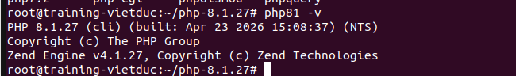
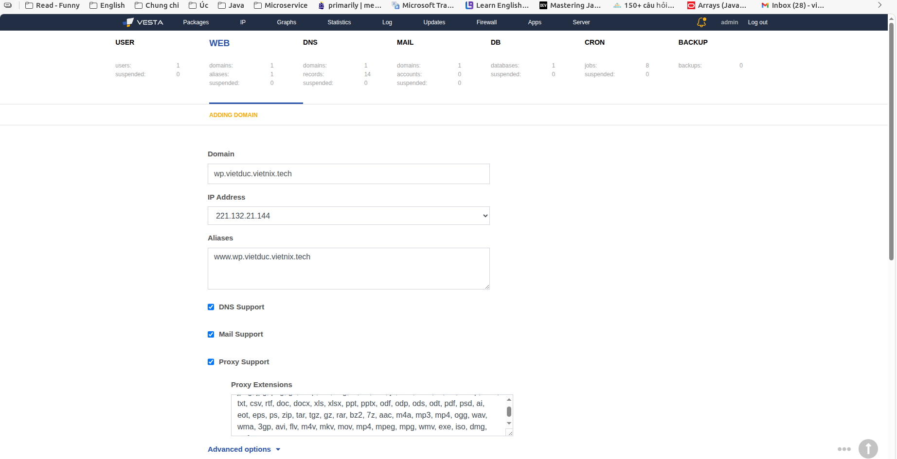
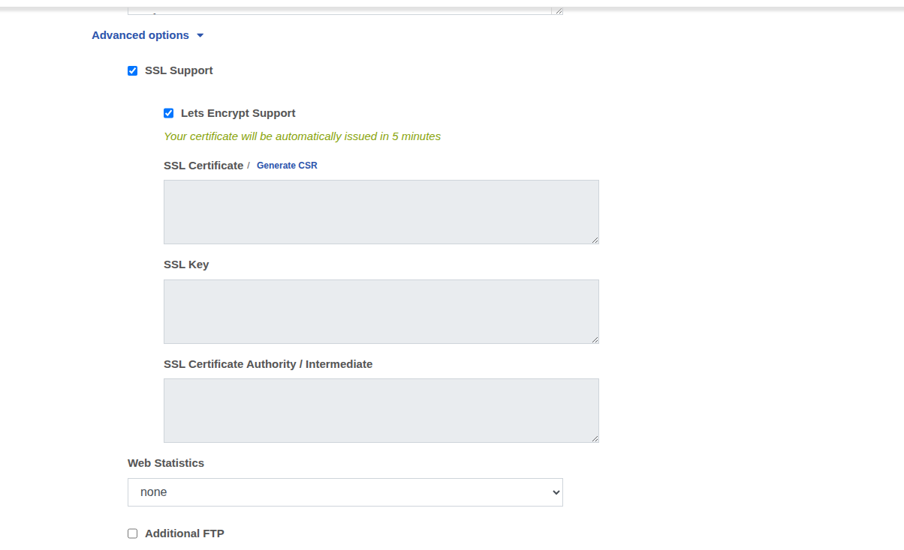
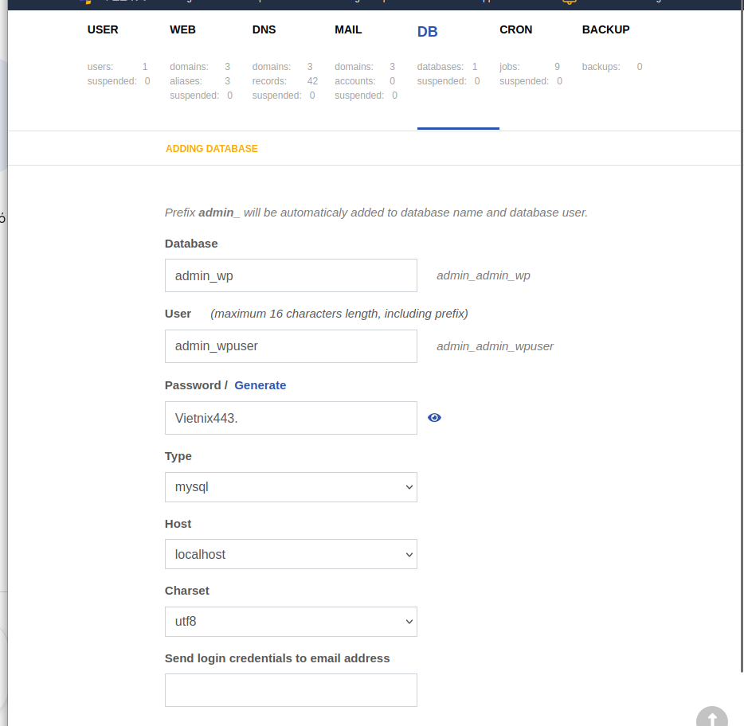

# Topic8 - VestaCP

## Table of Contents

# 1. Các file cấu hình

- Cấu hình Apache: /home/amin/conf/web/domain.apache2.conf
  - Mục đích: Chứa thông tin DocumentRoot, log và các chỉ dẫn PHP. Nếu chạy Laravel, cần sửa DocumentRoot ở đây từ public_html thành public_html/public.
- Cấu hình Nginx: /home/admin/conf/web/[domain].nginx.conf
  - Mục đích: Cấu hình Proxy pass sang Apache và xử lý file tĩnh (static files).
- Cấu hình SSL: /home/admin/conf/web/ssl.[domain].crt và /home/admin/conf/web/ssl.[domain].key

- File cấu hình MySQL: /etc/mysql/my.cnf hoặc /etc/mysql/mysql.conf.d/mysqld.cnf

- Lưu trữ dữ liệu: /var/lib/mysql/

- Log của VestaCP: /usr/local/vesta/log/system.log

# File cấu hình HTTP

cat /home/admin/conf/web/[domain].nginx.conf

# File cấu hình HTTPS (Chỉ xuất hiện sau khi bật SSL trong Panel)

cat /home/admin/conf/web/[domain].stpl

# File cấu hình HTTP

cat /home/admin/conf/web/[domain].apache2.conf

# File cấu hình HTTPS

cat /home/admin/conf/web/[domain].sapache2.conf 2.

# 2 Cài đặt

```bash
curl -O https://vestacp.com/pub/vst-install.sh

bash vst-install.sh


```

- Tài khoản

```bash
Congratulations, you have just successfully installed Vesta Control Panel

    https://221.132.21.144:8083
    username: admin
    password: 9AnEpk2OpN

```

Cài đặt PHP8.1

```bash
# Cài đặt công cụ hỗ trợ kho lưu trữ
apt-get update
apt-get install software-properties-common -y


# Thêm kho PPA của Ondrej (Để lấy các thư viện phụ trợ nhanh hơn)
add-apt-repository ppa:ondrej/php -y
apt-get update

# Cài đặt thư viện nền cho Giai đoạn 1.2
apt-get install -y build-essential libxml2-dev libssl-dev libsqlite3-dev \
libcurl4-openssl-dev libpng-dev libjpeg-dev libonig-dev libzip-dev \
libreadline-dev libicu-dev

# Bắt đầu Giai đoạn biên dịch (Compile)
wget https://www.php.net/distributions/php-8.1.27.tar.gz
tar -xvf php-8.1.27.tar.gz
cd php-8.1.27

# Cấu hình (Configure):
./configure --prefix=/usr/local/php81 \
--with-config-file-path=/usr/local/php81 \
--enable-mbstring \
--enable-fpm \
--with-mysqli=mysqlnd \
--with-pdo-mysql=mysqlnd \
--with-openssl \
--with-curl \
--with-zlib \
--enable-gd \
--with-zip \
--enable-bcmath \
--enable-intl

make -j$(nproc)
make install

```



- Kết quả





- Tạo web và cấp ssl tự động

- Đưa web lên

```bash
# Kich hoaat SSL
# Áp dụng cho WordPress
cat /root/vietnix_backup/wp_fullchain.pem > /home/admin/conf/web/ssl.wp.vietduc.vietnix.tech.crt
cat /root/vietnix_backup/wp_privkey.pem > /home/admin/conf/web/ssl.wp.vietduc.vietnix.tech.key

# Áp dụng cho Laravel
cat /root/vietnix_backup/laravel_fullchain.pem > /home/admin/conf/web/ssl.laravel.vietduc.vietnix.tech.crt
cat /root/vietnix_backup/laravel_privkey.pem > /home/admin/conf/web/ssl.laravel.vietduc.vietnix.tech.key

# Khởi động lại Nginx để nạp Cert mới
systemctl restart nginx

# Tiếp tục giải nén Source Code
# Giải nén mã nguồn
tar -xzvf /root/vietnix_backup/wp.tar.gz -C /home/admin/web/wp.vietduc.vietnix.tech/public_html/
tar -xzvf /root/vietnix_backup/laravel.tar.gz -C /home/admin/web/laravel.vietduc.vietnix.tech/public_html/

# Phân quyền cho user admin
chown -R admin:admin /home/admin/web/*/public_html/
```

- Tạo db cho từng web



Database: wp (Tên đầy đủ sẽ là admin_wp).

User: wpuser (Tên đầy đủ sẽ là admin_wpuser).

```bash
mysql -u admin_wpuser -p admin_wp < /root/vietnix_backup/wp.sql
mysql -u admin_laruser -p admin_laravel < /root/vietnix_backup/laravel.sql

# Cập nhật file Config
# Wordpres
nano /home/admin/web/wp.vietduc.vietnix.tech/public_html/wp-config.php

#Laravel
nano /home/admin/web/laravel.vietduc.vietnix.tech/public_html/.env
```
