# Topic 9 - Windows Server

## Table of Contents

# 1. Cài đặt các công cụ phụ trợ

```bash
# Cài đặt RDP trên ubuntu
sudo apt update
sudo apt install remmina remmina-plugin-rdp -y

```

# 2. Thực hiện allow port, allow ip trên windows firewall

```bash
# Mở Port 80 (HTTP):
New-NetFirewallRule -DisplayName "Allow HTTP" -Direction Inbound -LocalPort 80 -Protocol TCP -Action Allow


# Cho phép 1 IP cụ thể:
New-NetFirewallRule -DisplayName "Allow Dev IP" -Direction Inbound -RemoteAddress 192.168.1.10 -Action Allow
```

- Kiêm tra port:

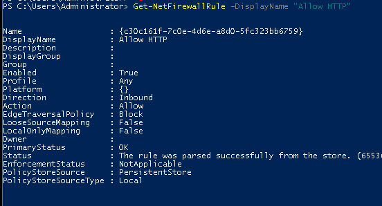

- Kiêm tra xem port đã được mở chưa:

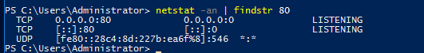

-

- Kiểm tra xem IP đã được allow chưa:

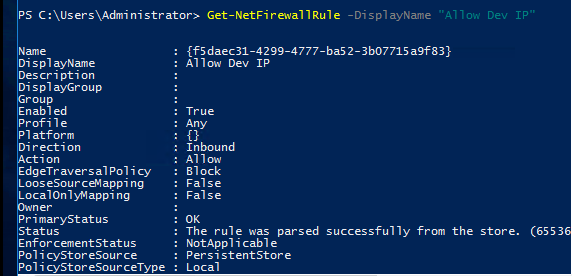

- Kiểm tra rule áp dụng cho IP nào

```bash
(Get-NetFirewallRule -DisplayName "Allow Dev IP" | Get-NetFirewallAddressFilter)
```

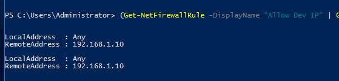

- Thêm thử một rule khác để allow IP .11:

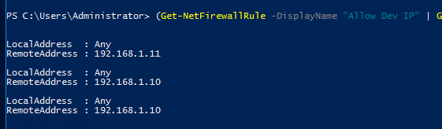

# 3. Thực hiện block port, block ip trên windows fw

```bash
# Block Port 8080 (Custom):
New-NetFirewallRule -DisplayName "Block Custom Port" -Direction Inbound -LocalPort 8080 -Protocol TCP -Action Block

# Block một IP cụ thể:
New-NetFirewallRule -DisplayName "Block Attacker" -Direction Inbound -RemoteAddress 192.168.1.100 -Action Block

-

# Kiểm tra xem port đã bị block chưa:
(Get-NetFirewallRule -DisplayName "Block Custom Port" | Get-NetFirewallPortFilter)

# Kiểm tra xem IP đã bị block chưa:
(Get-NetFirewallRule -DisplayName "Block Attacker" | Get-NetFirewallAddressFilter)
```

- Kiểm tra xem port nào bị block:

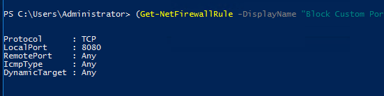

- Kiểm tra xem IP nào bị block:

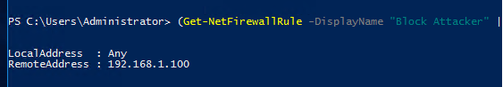

- Kết quả kiểm tra sau khi allow 80 và block 8080:

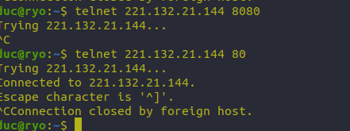

# 4. Thực hiện giới hạn port, giới hạn ip trên windows fw chỉ cho phép ip chỉ định truy cập

- Kiêm tra IP cuẩ máy đang sử dụng:

```bash
curl ifconfig.me
```

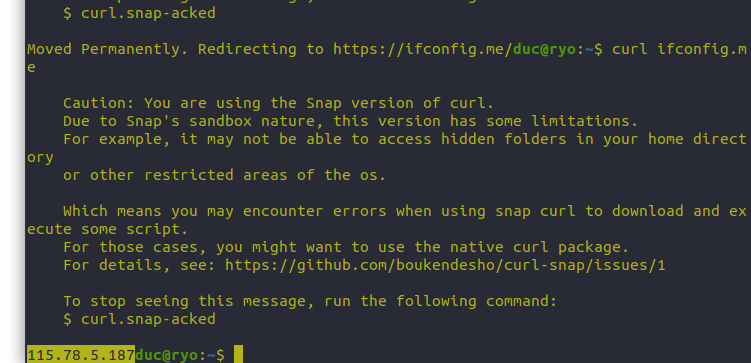

```bash
# Alow IP máy
New-NetFirewallRule -DisplayName "Allow Web MyIP" `
  -Direction Inbound `
  -Protocol TCP `
  -LocalPort 80 `
  -RemoteAddress 113.23.45.67 `
  -Action Allow

# Block tất cả IP khác
New-NetFirewallRule -DisplayName "Block Web Others" `
  -Direction Inbound `
  -Protocol TCP `
  -LocalPort 80 `
  -Action Block
```

- Kiểm tra tại máy chính:


- Kiểm tra tại máy khác:


# 5. Webserver IIS, trên Webserver IIS

- IIS (Internet Information Services) là một Web Server của Microsoft chạy trên hệ điều hành Windows. Nó có nhiệm vụ nhận các yêu cầu (request) từ trình duyệt web (như Chrome, Edge) và trả về nội dung trang web. IIS tương đương với Apache hoặc Nginx trên Linux.

- Cài đặt IIS trên Windows Server 2016:
  1. Mở Server Manager (Trình quản lý máy chủ) từ Start Menu.

  2. Chọn "Add roles and features" (Thêm vai trò và tính năng).

  3. Trong wizard hiện ra, chọn "Role-based or feature-based installation" và nhấn Next.

  4. Chọn server mà bạn muốn cài đặt IIS và nhấn Next.

  5. Trong phần "Select server roles", tìm và tích chọn "Web Server (IIS)". Một cửa sổ pop-up sẽ xuất hiện yêu cầu bạn thêm các tính năng phụ trợ cần thiết cho IIS, hãy nhấn "Add Features" để đồng ý.

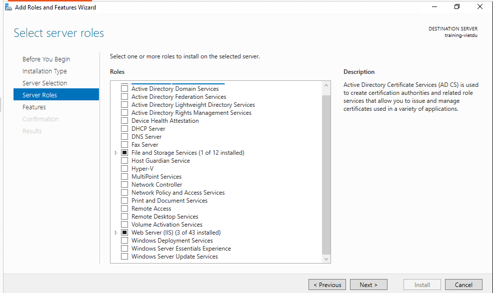

- Chọn Web Server (IIS) và các tính năng phụ trợ cần thiết:

- Application Development: Mở rộng mục này và tích chọn CGI (đây là thành phần bắt buộc để chạy PHP cho WordPress).

- Common HTTP Features: Đảm bảo đã tích Default Document, Directory Browsing, HTTP Errors, và Static Content.

- Security: Nên tích thêm IP and Domain Restrictions (để thực hiện bài lab giới hạn IP truy cập website bằng giao diện nếu bạn muốn).

- Kiểm tra kết quả sau khi cài đặt cả trên web và trên powershell

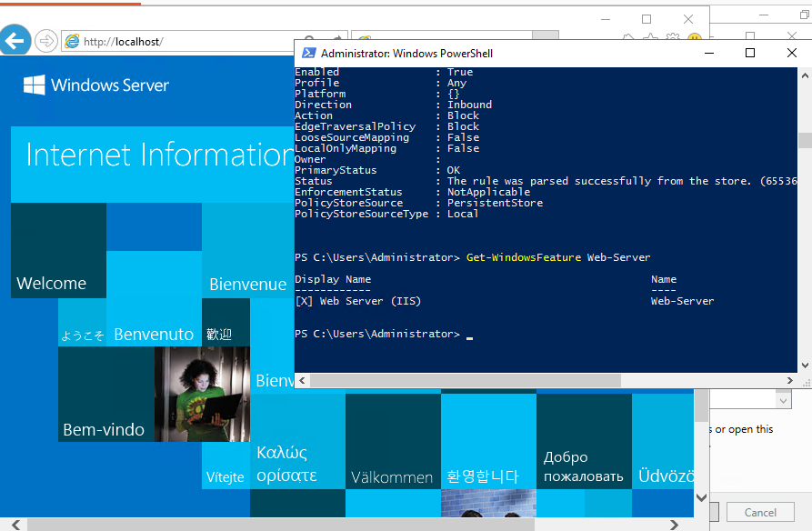

5.a. Cài đặt website wordpress mặc định

- Cài đặt PHP 8.1 cho IIS trên Windows Server 2016:

```bash
# Đăng ký module FastCGI với IIS
& $env:windir\system32\inetsrv\appcmd.exe set config /section:system.webServer/fastCgi /+"[fullPath='C:\php81\php-cgi.exe']"

# Tạo mapping cho đuôi .php
& $env:windir\system32\inetsrv\appcmd.exe set config /section:system.webServer/handlers /+"[name='PHP81_FastCGI',path='*.php',verb='*',modules='FastCgiModule',scriptProcessor='C:\php81\php-cgi.exe',resourceType='Either']"

-

# Bật TLS 1.2
[Net.ServicePointManager]::SecurityProtocol = [Net.SecurityProtocolType]::Tls12

# Tải WordPress
Invoke-WebRequest -Uri "https://wordpress.org/latest.zip" -OutFile "C:\inetpub\wwwroot\wordpress.zip"

# Giải nén sau khi tải xong
Expand-Archive -Path "C:\inetpub\wwwroot\wordpress.zip" -DestinationPath "C:\inetpub\wwwroot" -Force

-

# Cấp quyền cho IIS để nó có thể ghi file cấu hình:
$acl = Get-Acl "C:\inetpub\wwwroot\wordpress"
$rule = New-Object System.Security.AccessControl.FileSystemAccessRule("IIS_IUSRS","Modify","ContainerInherit,ObjectInherit","None","Allow")
$acl.AddAccessRule($rule)
Set-Acl "C:\inetpub\wwwroot\wordpress" $acl

-
# Kích hoạt Extension MySQLi trong file php.ini
# 1. Di chuyển vào thư mục PHP
$phpIniPath = "C:\php81\php.ini"

# 2. Tạo file php.ini
if (!(Test-Path $phpIniPath)) {
    Copy-Item "C:\php81\php.ini-development" $phpIniPath
}

# 3. Mở khóa extension_dir và các extension quan trọng
(Get-Content $phpIniPath) | ForEach-Object {
    $_ -replace ';extension_dir = "ext"', 'extension_dir = "ext"' `
       -replace ';extension=mysqli', 'extension=mysqli' `
       -replace ';extension=mbstring', 'extension=mbstring' `
       -replace ';extension=gd', 'extension=gd' `
       -replace ';extension=curl', 'extension=curl' `
       -replace ';extension=openssl', 'extension=openssl'
} | Set-Content $phpIniPath

# 4. Khởi động lại IIS để áp dụng thay đổi
iisreset
```

- Thông tin database:

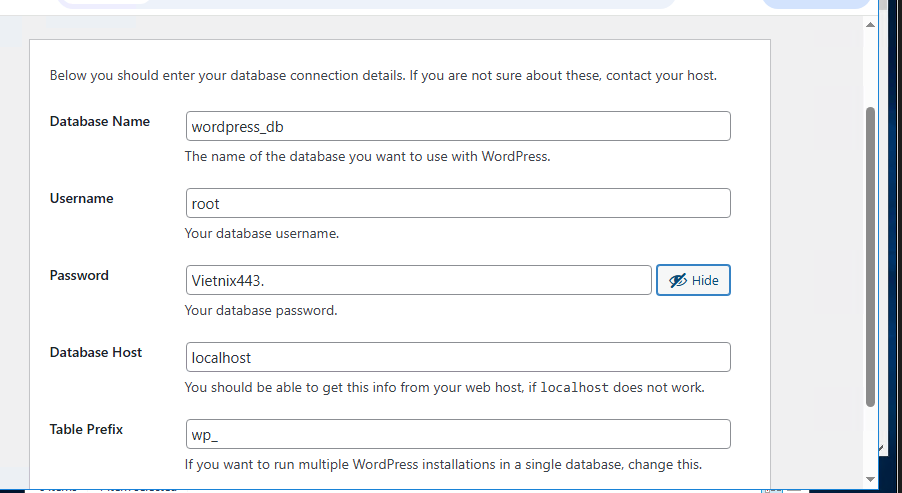

5.b. Cài đặt SSL

# 6. SQL Server: 2016

Chuột phải vào file ISO vừa tải -> Chọn Mount. Một ổ đĩa ảo sẽ hiện ra.

Chạy file setup.exe.

Tại bảng hiện ra, chọn dòng: Installation -> New SQL Server stand-alone installation...

Cứ nhấn Next cho đến mục Feature Selection:

    BẮT BUỘC: Tích chọn Database Engine Services.

Mục quan trọng nhất (Database Engine Configuration):

    Chọn Mixed Mode (SQL Server authentication and Windows authentication).

    Nhấn nút Add Current User để cấp quyền quản trị

- Kiểm tra công 1433 đã được mở chưa:

```bash

Test-NetConnection -ComputerName localhost -Port 1433
```

- Kiểm tra quyền của tài khoản sa

```bash
$sqlcmd = "C:\Program Files\Microsoft SQL Server\Client SDK\ODBC\130\Tools\Binn\SQLCMD.EXE"
& $sqlcmd -S "127.0.0.1,1433" -U "sa" -P "Vietnix443." -Q "SELECT name FROM sys.databases"
```

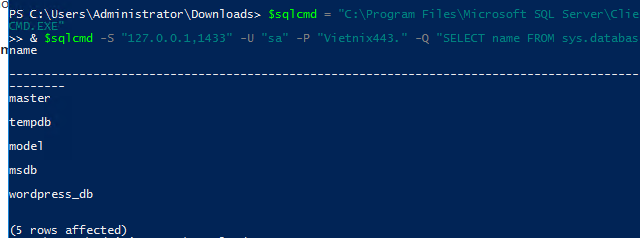

7. Vì SQL server không tương thích tốt bằng MySQL Server nên sẻ dùng MySQL

```bash
# Login MySQL
.\mysql.exe -u root
-- 1. Tạo Database
CREATE DATABASE wordpress_db;

-- 2. Thiết lập mật khẩu cho root
ALTER USER 'root'@'localhost' IDENTIFIED WITH mysql_native_password BY 'MatKhauMoi';

-- 3. Lưu thay đổi
FLUSH PRIVILEGES;

-- 4. Thoát
EXIT;
```

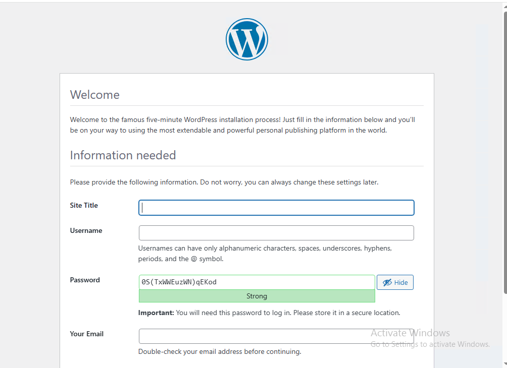

- Kết quả
